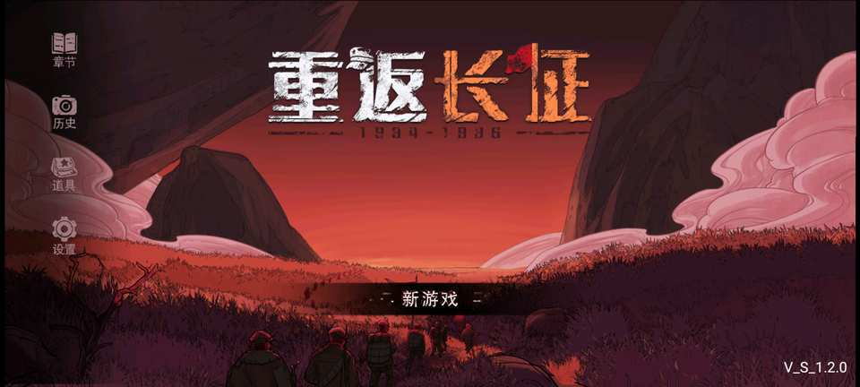
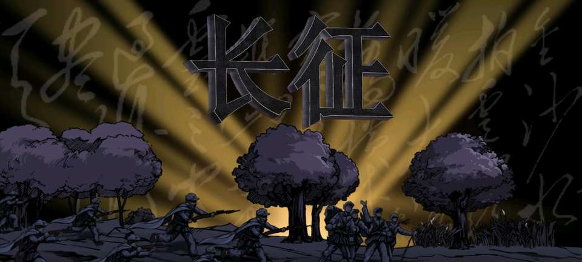
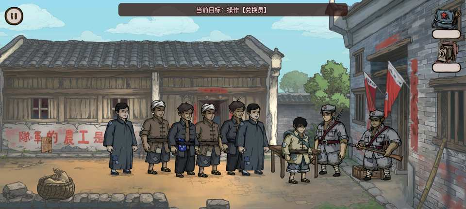
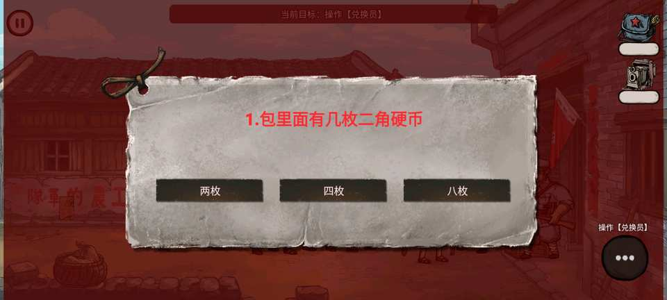

# 重返长征路（Cocos Creator 2.4.15 维护版）

本工程从 APK `E:\APPs\cfczl100\cfczl3.apk` 的原始 Creator 2.4.3 构建内容重新恢复，现已迁移到 Creator 2.4.15；不包含此前 Creator 3.8.8 复刻版的代码或资源。

原 APK 的 `assets/src/cocos2d-jsb.js` 明确记录 `cc.ENGINE_VERSION = "2.4.3"`。当前维护运行时为 2.4.15；工程保持原始场景结构、美术、音频、动画、配置和 JavaScript 游戏逻辑，不重新设计玩法。

## 画面速览

| 主菜单与原版动态片头 | 历史坐标与长征路线 |
| --- | --- |
|  |  |
|  |  |

| 村庄与医疗点 | 白石渡交互 |
| --- | --- |
|  |  |
|  |  |


全部发布截图位于 [`screenshots/`](screenshots/)；它们均来自 1.2.0 Release 验证或对应的
最终回归场景。

## 固定工具链

- Cocos Creator：`E:\temp\CocosCreator-2.4.15\CocosCreator.exe`
- 当前引擎版本：2.4.15（原 APK 为 2.4.3）
- 调试/发布构建 JDK：17，`E:\temp\jdk17`
- Android NDK：r20b / 20.1.5948944
- 调试 Android SDK：API 28 / Build Tools 28.0.3
- 发布 Android SDK：API/target 36 / Build Tools 35.0.0
- 业务逻辑：JavaScript（恢复模块已改为描述职责的 PascalCase 名称）
- 目标 ABI：仅 `arm64-v8a`
- Android 包名：`com.game.longmarch.creator243`（保留以兼容既有安装数据和升级链）

## 源文件恢复

原始脚本总包保存在 `recovery/original-main-index.js`。执行：

```powershell
node .\tools\recover-original-scripts.js
```

脚本会拆出原始 JavaScript 模块，使用 APK 中的 `cc._RF` 类 ID 还原 `.meta` UUID。日常
开发使用可读命名后的文件；完整旧名/新名映射由
[`docs/project/naming-migration.json`](docs/project/naming-migration.json)记录。

资源恢复与完整性校验：

```powershell
node .\tools\restore-original-resources.js --verify
```

当前校验结果为 524 个原图集切片和 1513 个原始路径 UUID 全部匹配。恢复清单保存在 `recovery/original-scripts-manifest.json` 与 `recovery/original-resources-manifest.json`。

## Android 构建

从 Creator 工程生成 Android 工程并编译：

```powershell
.\tools\build-android.ps1
```

如果 `build/jsb-link` 已经由 Creator 生成，只做增量编译：

```powershell
.\tools\build-android.ps1 -SkipGenerate
```

源代码或资源有变化、希望保留原生中间产物时：

```powershell
.\tools\build-android.ps1 -IncrementalGenerate
```

正式签名 APK/AAB：

```powershell
.\tools\build-android-release.ps1 `
  -SigningProperties E:\安全目录\longmarch-signing.properties `
  -VersionCode 2026072902 `
  -VersionName 1.2.0
```

发布流程使用 AGP 8.9.2、Gradle 8.11.1、JDK 17、targetSdk 36，执行 R8、签名、
`zipalign`、`apksigner`、arm64 单 ABI、零权限及离线依赖核验。调试产物：

`dist/chongfanchangzhenglu-arm64-debug.apk`

APK/AAB 属于可重复生成的构建产物，不提交到 Git；本地最终 APK 仍输出到 `dist/`。

## 可读命名与资源结构

- 55 个历史脚本已经改为描述职责的 PascalCase 名称。
- 1179 个资源路径按领域整理；章节地图拆分为 `chapter-1`、`chapter-2`、`chapter-3`
  Asset Bundle。
- `AssetCatalog` 保留旧配置路径和旧组件名兼容；`.meta` UUID、场景/事件 ID 和存档键不变。
- 新增或重命名前请阅读
  [`docs/project/naming-conventions.md`](docs/project/naming-conventions.md)，并执行 `npm test`。

## 操作方法

- 手机或模拟器：单击/轻触道路或地面，角色会走向点击位置。这是首关的主要移动方式。
- 键盘：`A` / `D` 或方向键左 / 右控制水平移动；在梯子上使用 `W` / `S` 或方向键上 / 下。
- 靠近可交互物后，点击右下角出现的操作按钮；世界空间的手势气泡也可直接点击。剧情强制等待期间不会响应移动。

## 已完成验证

- Creator 2.4.15 Web Mobile 构建成功，无资源缺失警告。
- Android arm64 原生库与 APK 构建成功，APK 内无 arm32/x86/x86_64。
- Android 四档启动图标逐字节复用原 APK 图标，并由构建门禁自动核验。
- 雷电模拟器安装、启动和触控成功；已用 ADB 点击与长按滑动回归验证角色移动及镜头跟随。
- Android Activity 已强制横屏，16:9 与 20:9 的片头、加载、主菜单及 HUD 使用统一的
  fixed-height 适配；不再运行在 2.4.15 下附件错位的旧片头 Spine。
- 已恢复游戏 BGM、章节音乐和动作音效的真实资源路由，增加走/跑脚步声，并修复语音滑块
  误伤全局脚步/动作音效及单个距离音量泄漏到后续音效的问题。
- 已修复同图前后景门传送后摄像机仍停在旧层的问题；摄像机边界按实际可视尺寸和缩放计算。
- 已使用 ADB 完整通关当前版本的三大章、七张地图；第三章结局会显示原作自带的“后续关卡正在开发中，敬请期待”，确认后可正常返回主菜单。
- 已修复运行时地图遮住 UI/触摸控制层的问题，并在首关实测点击地面后角色和镜头正常移动。
- 方向输入会跟踪仍按住的键，避免按键重复、多键切换、触摸取消或剧情短暂锁定时意外停止角色。
- 已修复 Android 原生端触点与世界气泡投影坐标缩放不一致的问题，物品气泡不再吞掉右侧大块道路点击，底部操作键和道路移动可同时正常使用。
- 任务交互恢复为原作的碰撞接触范围，不再扫描远处任务物品；实际接触范围内仍按手持物和
  当前任务做确定性排序，避免错交给相邻人物。
- 已修复兑换员前方阻挡导致无法贴近的问题；无需扩大交互半径也能正常对话和答题。
- 原版纯亮红转场牌已明确为带“历史坐标”标题、淡入淡出的深红史实牌，避免被误认为故障。
- 已修复搬运物资时道路点击误触操作键、旧 Spine `Slot.color` API 在新版原生运行时抛错或崩溃等问题。
- 已逐项验证拾取、搬运、投递、答题、收藏卡、跨图跟随、剧情跳过、章节结算和终局返回主菜单。
- `settings.js`、主资源包、ARM32/ARM64 原生库均已核验存在。
- 已通过 ADB 安装并启动最新 APK；地面触摸回归未再出现 JavaScript 异常。
- 世界空间的任务/物品引导卡片按新版原生视口缩放为 55%，避免遮挡附近的交互气泡。

代码、章节体验、稳定性、性能及正式发布门槛的综合结论见
[`docs/project/codebase-audit-2026-07-27.md`](docs/project/codebase-audit-2026-07-27.md)；
第二轮专项审计、实施结果和剩余风险见
[`docs/project/codebase-audit-followup-2026-07-27.md`](docs/project/codebase-audit-followup-2026-07-27.md)；
2.4.15 的构建输入、兼容修复和完整验证证据见
[`docs/project/cocos-creator-2.4.15-migration-and-validation-2026-07-27.md`](docs/project/cocos-creator-2.4.15-migration-and-validation-2026-07-27.md)。

1.1.1 的手机横屏、镜头、BGM/音效和脚步声专项证据见
[`docs/testing/mobile-audio-landscape-camera-validation-2026-07-27.md`](docs/testing/mobile-audio-landscape-camera-validation-2026-07-27.md)。
1.1.3 的真机/模拟器开场、Spine 完整性、持有物、兑换交互和前后景镜头复测见
[`docs/testing/mobile-spine-interaction-camera-regression-2026-07-28.md`](docs/testing/mobile-spine-interaction-camera-regression-2026-07-28.md)。
1.1.4 的原版动态片头、任务道具回收、第二章出口和七关任选回归见
[`docs/testing/opening-item-progression-level-selection-regression-2026-07-29.md`](docs/testing/opening-item-progression-level-selection-regression-2026-07-29.md)。
1.2.0 的原版图标、碰撞范围、深红史实牌、arm64 单 ABI 和原版对照全量通关见
[`docs/testing/original-apk-parity-and-full-playthrough-2026-07-29.md`](docs/testing/original-apk-parity-and-full-playthrough-2026-07-29.md)。

## 通关文档

- 开发、测试和发布人员：
  [`docs/testing/full-playthrough-test-process.md`](docs/testing/full-playthrough-test-process.md)
- 玩家：
  [`docs/guides/player-walkthrough.md`](docs/guides/player-walkthrough.md)
- 整体故事与逐关叙事：
  [`docs/story/complete-story-and-levels.md`](docs/story/complete-story-and-levels.md)
- 爱国主义教育定位与使用建议：
  [`docs/education/patriotic-education-and-design.md`](docs/education/patriotic-education-and-design.md)

## 工程原则

- 场景、预制体、动画、配置、图片、音频、Spine 与 DragonBones 数据均来自 APK 原始资源。
- 尊重原作玩法和叙事，同时保留经过验证的修复、横屏适配、自动存档与七关任选等维护增强。
- 不编写 C++ 游戏逻辑；Android 原生包只使用 Creator 2.4.15 自带运行时。
- 构建时只启用 `arm64-v8a`。
