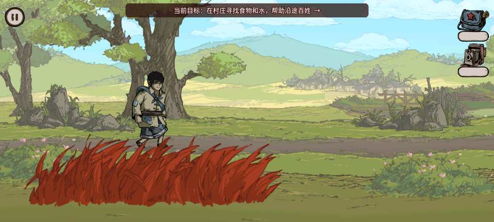
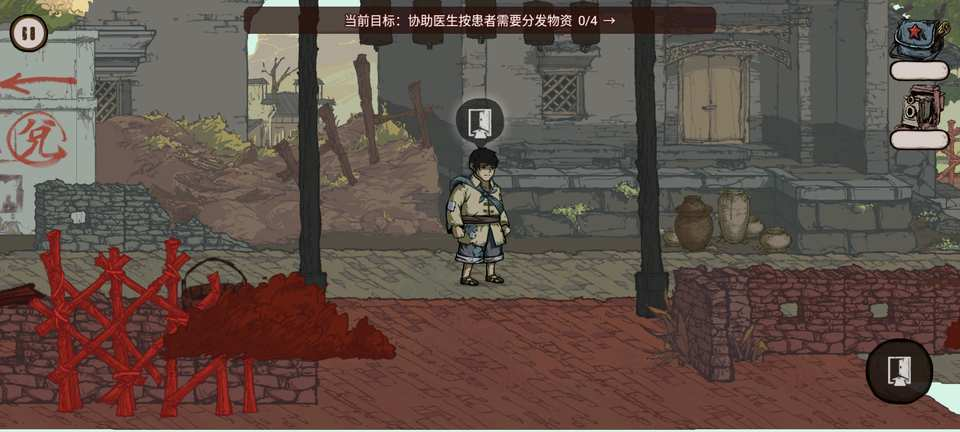
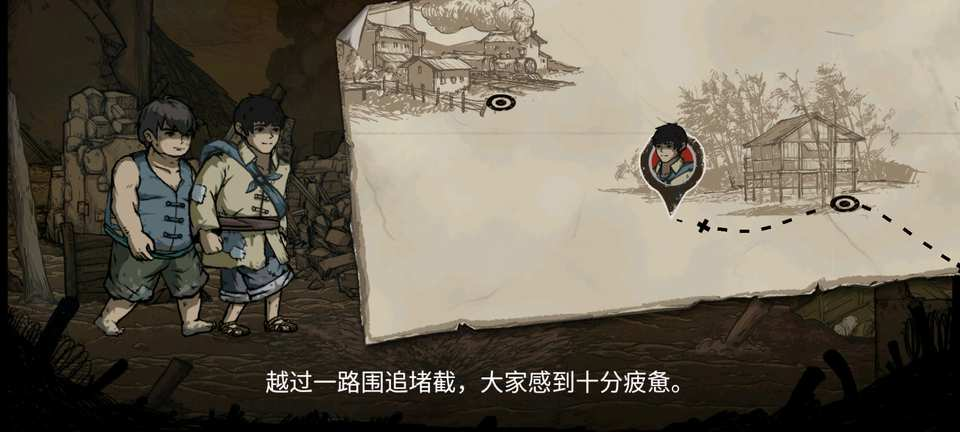

# 1.2.0 原版 APK 对照与全量通关验证

日期：2026-07-29

工程：`F:\bigsinger\chongfanchangzhenglu`

原版：`E:\APPs\cfczl100\cfczl3.apk`

## 最终结论

1.2.0 已完成原版资源与行为对照、七张发布地图轮巡、主线事件图全量校验及关键交互黑盒
复测。原版图标已经完整恢复；任务交互回到碰撞接触范围；兑换员可以实际走近并进入三题
核对；原版突兀的纯亮红时间牌改为有明确语义和淡入淡出的深红“历史坐标”牌；Android
构建只保留 `arm64-v8a`。

本轮没有回退维护版已经做好的横屏适配、动态片头修复、镜头层切换、音频与脚步声、任务
道具回收、第二章出口、自动存档、任务提示、卡片缩放和七关任选。静态和运行日志中没有
JavaScript 异常、Native fatal、ANR 或资源加载失败。

## 原版事实基线

| 对照项 | 原版事实 | 1.2.0 处理 |
|---|---|---|
| 引擎 | `cocos2d-jsb.js` 记录 `cc.ENGINE_VERSION = "2.4.3"` | 维护运行时升级为 2.4.15 |
| 包名 | `com.game.longmarch` | 维护包名 `com.game.longmarch.creator243`，避免覆盖原版 |
| 图标 | mdpi 48、hdpi 72、xhdpi 96、xxhdpi 144 像素 | 四档 PNG 从原 APK 原样恢复，构建时再次校验 |
| 原生库 | 原 APK 只有 `armeabi-v7a` | 新包只保留现代设备使用的 `arm64-v8a` |
| 交互来源 | 只有物理碰撞进入 `itemStack`，离开后以横纵轴 300 单位清理 | 恢复同一模型；不再扫描 520/720 单位外的任务目标 |
| 转场牌 | `transitionScene.fire` 的底色为纯红 `255,0,0` | 保留时间地点，改为深红、标题和淡入淡出 |
| 内容范围 | 三章主线；恢复配置中另有未发布编辑数据 | 只把有完整地图的三章七图列为发布内容 |

原 APK 的纯红画面不是随机资源损坏，而是作者设置的章节年代地点牌。它缺少标题且颜色过
亮，容易被玩家误认为渲染故障，因此采用“保留信息、改善表达”的修复。

## 交互范围专项

### 代码合同

- `GameplayEventController` 只从物理接触栈选择候选，不遍历整张地图；
- 横、纵轴任一超过 300 设计单位即清除陈旧候选；
- 同一接触区内若有多个目标，仍按手持物匹配接收者、普通任务、门的顺序确定性裁决；
- 世界空间气泡只命中自身可见区域，底部 84 像素 HUD 操作键不扩大世界交互半径；
- 顶部任务追踪只提供方向与近距离动作文字，不把目标直接注入交互栈。

### 兑换员可达性

原配置在兑换员前方放置了宽 100 的无形“阻挡”，角色会停在碰撞传感器之外。旧维护版
把交互范围放大到 520/720 来绕开，虽然能触发，却造成远处误操作。本轮把阻挡缩为 30，
移到兑换员传感器后方；剧情会在领取物资箱前按原事件隐藏它。因此：

- 站在远处点击右下区域，只会沿道路移动；
- 角色走到兑换员身旁后，才出现“操作【兑换员】”；
- 再次点击操作键，正常进入蓝布包三题；
- 领取物资箱阶段仍有完整可行走空间。

## 全量通关覆盖

本轮按用户允许的高效策略复用存档检查点和构造状态：事件前写入最小必要章节、地图和
英雄位置，运行真实 Creator 场景、物理碰撞、UI 和事件回调；修复后从同一节点复测，不
从片头反复开始。事件图门禁同时遍历全部 12 个恢复场景数据、1218 个事件和 802 条跳转，
确保跳过中间状态不会漏掉配置分支。

| 发布地图 | 主线/交互覆盖 | 结果 |
|---|---|---|
| 第一章·村庄主路 | 移动、求救对白、铁锹、红薯火候、灭火、出口 | 通过 |
| 第一章·取水支路 | 空桶、收藏、返回主路、跨图携带 | 通过 |
| 第二章·战场主路 | 伤员、战斗演出、队伍撤离、第二章出口 | 通过 |
| 第二章·村屋水源 | 老农近身对白/三题、柴刀、竹筒、取水 | 通过 |
| 第三章·白石渡主路 | 蓝布包线索、参军换装、政委补给、终局 | 通过 |
| 第三章·医疗点 | 第一轮 4 次、物资箱、第二轮 5 次、道具回收 | 通过 |
| 第三章·小学堂兑换点 | 小偷、兑换员三题、物资箱、红星报、门 | 通过 |

七图自动轮巡逐图执行冷场景加载、道路移动、进入后台、返回前台、状态查询和内存采样。
两分钟窗口覆盖前六图；第七图小学堂另有兑换员完整黑盒用例和日志，因此七图均有本构建
运行证据。

## 章节过场验证

第二章出口使用真实事件 33 构造到最后一步，连续截取 1.5 秒间隔的画面。序列实际经历：

1. 黑场收束；
2. 旧战场淡出；
3. “历史坐标｜1934年11月，宜章县白石渡镇”深红牌；
4. 小二娃与二虎进入长征路线演出；
5. 字幕说明队伍越过围追堵截、在白石渡整备扩红；
6. 点击任意位置继续。

画面没有碎片化、纯亮红闪屏或永久停留，日志无异常。

## 构建与体积

| 项目 | 结果 |
|---|---|
| 版本 | `1.2.0 (2026072902)` |
| Debug APK | `dist/chongfanchangzhenglu-arm64-debug.apk` |
| Debug 大小 | 150,588,265 字节 |
| ABI | 仅 `arm64-v8a` |
| Android | minSdk 21、targetSdk 36、权限 0 |
| 图标 | 四档原版 PNG，源码与生成工程一致 |
| 模拟器 | `emulator-5554`；ABI 列表含 arm64，通过 `libnb.so` 转译 |

上一版双 ABI Debug 为 162,358,514 字节，本版减少 11,770,249 字节，约 11.2 MiB；原生
编译也只需生成一套库。最终 Release APK 不提交 Git，也不计算文件哈希。

## 自动门禁

- JavaScript 语法、相对依赖和 JSON 全部通过；
- 配置图 0 error；440 项原作历史警告与固定基线一致；
- 发布内容固定为 7 张地图、13 件收藏、10 条当前章节史实、6 道主线答题；
- 524 个图集切片和 1513 个原始路径 UUID 完整；
- 55 个脚本、1179 个资源、3 个 Asset Bundle 的可读命名通过；
- 869 张 PNG、60 个 Spine atlas、1042 个附件通过纹理与图集完整性门禁；
- Android lint、NDK、Gradle、APK ABI、零权限、离线依赖和图标门禁通过；
- WAL 安全检查点导出/恢复通过，不再只复制遗漏 WAL 的主数据库文件。

## 发布前复核清单

- [x] 原版四档图标
- [x] 仅 arm64
- [x] 远处不执行任务
- [x] 兑换员近身交互和三题
- [x] 深红史实牌与章节继续
- [x] 七张地图加载、移动、前后台恢复
- [x] 全事件图、收藏、史实、答题与资源完整性
- [x] 片头、道具回收、第二章出口、七关任选不回退
- [ ] 最终签名 Release 构建、安装和不可调试复核

最后一项在正式签名包生成后填写；正式包路径和安装结论在本任务最终交付说明中给出。
